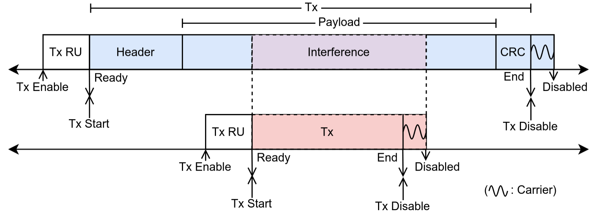
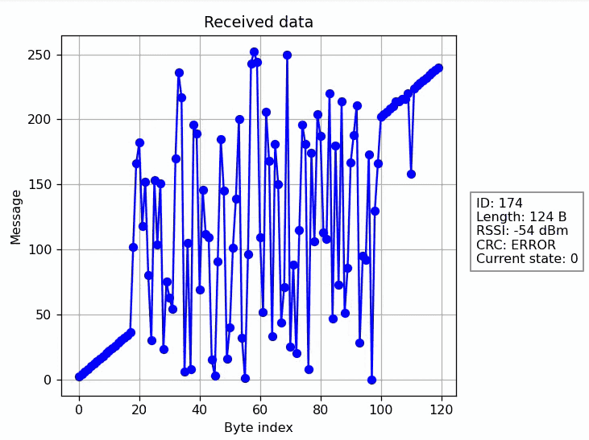
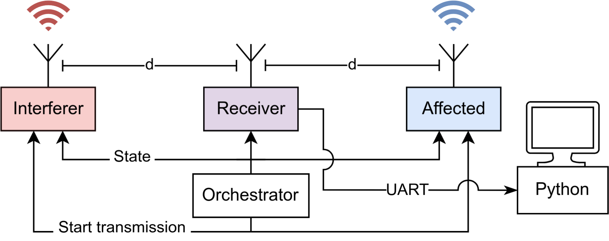
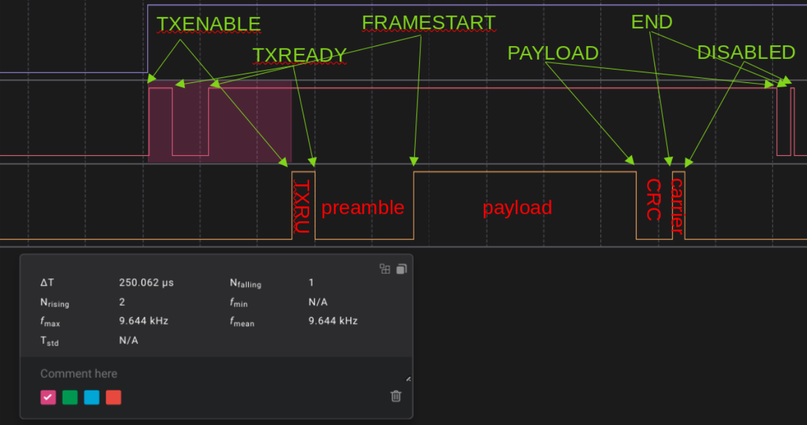

# Experimental Investigation of Bit Errors in Coexisting BLE and IEEE 802.15.4 Channels  

[![License][license-badge]][license-link]  

## Overview  

This repository contains the source code required to replicate the results from 
*Experimental Investigation of Bit Errors in Coexisting BLE and IEEE 802.15.4 Channels*.  
Diego Badillo-San-Juan,
Alfonso Cortes,
Said Alvarado-Marin,
Alexandre Abadie,
Fabian Graf,
Thomas Watteyne,
Filip Maksimovic.
IEEE SmartComp 2025


<div align="left">  
  <figure>
    
    <figcaption>Timing diagram of a packet under interference. Upward and downward arrows represent radio task and events respectively.</figcaption>
  </figure>  
  
  <figure>
    
    <figcaption>An affected packet consisting of bytes in ascending order is blocked by a controlled interference. The ID increasing represents a new packet received. The interference is turned on and off.</figcaption>
  </figure>
</div>


## Experimental Setup and Firmware  

Four **nRF52840-DK** boards were utilised. The following firmware should be flashed onto the respective boards:  

- **Interferer** → `01bsp_radio_tx_blocker`  
- **Affected Transmitter** → `01bsp_radio_tx`  
- **Receiver** → `01bsp_radio_rx`  
- **Orchestrator** → `01bsp_radio_tx_master`  

<div align="left">  
    
  <figcaption>Wired and over-the-air connections between interferer, affected transmitter, and receiver.</figcaption>
</div>  

Following the experimental setup diagram:  

- The **State** signal is assigned to **pin 1.10** on all boards.  
- The **Start Transmission** signal is assigned to **pin 1.11** on all boards (except the receiver).  
- **Pin 1.12** is used for event visualisation in a digital analyser.  

<div align="left">  
    
  <figcaption></figcaption>
</div>  

The source code for the different applications in this repository can be built using  
[SEGGER Embedded Studio for ARM](https://www.segger.com/downloads/embedded-studio).  

### Setting Up SEGGER Embedded Studio  

1. Open SEGGER Embedded Studio.  
2. Navigate to **Tools** > **Package Manager**.  
3. Install the following packages:  
   - **CMSIS 5 CMSIS-CORE**  
   - **CMSIS-DSP**  
   - **nRF packages**  

For further details, refer to the [official documentation](https://studio.segger.com/index.htm?https://studio.segger.com/home.htm).  

## Python Scripts  

The repository includes the following Python scripts:  

- `serial_logger.py`  
- `data_analysis.ipynb`  
- `config_generators.py`  

### `serial_logger.py`  

The `serial_logger.py` script reads packets received via the serial port from an **nRF** board. Each packet consists of:  

- **Incremental ID** (4 bytes)  
- **Effective payload** (up to 120 bytes)  

The experimental variables (e.g. protocol type and interference mode) are defined in `config.py`.  

The received messages are stored in a **JSONL** file with the following format:  

```json  
{"id": 2030, "message": [0, 2, 4, ..., 234, 236, 238], "length": 124, "rssi": -28, "crc": 1, "config_state": 5}  
```  

#### File Naming Convention  

JSONL files are stored in the `experiment_data` folder and named according to the experiment variables set in `config.py`, following this pattern:  

```  
{tx_mode}_{block_mode}_{tx_power}dBm{block_power}dBm_{tx_freq}MHz{block_freq}MHz_delay{block_delay}us_tx{tx_size}B_block{block_size}B.jsonl  
```  

Where:  

- `tx_mode` → Protocol used by the affected link  
- `block_mode` → Mode of the interference  
- `tx_power` → Transmission power (dBm) of the affected transmitter  
- `block_power` → Transmission power (dBm) of the interference  
- `tx_freq` → Frequency (MHz) of the affected transmitter  
- `block_freq` → Frequency (MHz) of the interference  
- `block_delay` → Delay (µs) applied to the interference  
- `tx_size` → Size (Bytes) of the affected packet  
- `block_size` → Size (Bytes) of the interference  

#### Example File Name  

```  
BLE1MBit_IEEE802154250Kbit_0dBm-4dBm_2425MHz2423MHz_delay255us_tx120B_block8B.jsonl  
```  

#### Usage  

To begin data logging, run:  

```bash  
python serial_logger.py --save  
```  

Additional options:  

- Use `--plot` to **visualise** packets in real time.  
- Use `--print` to **print** received packets in real time.  

### `data_analysis.ipynb ` 

To replicate the figures presented in the paper, first uncompress `data.zip` in `python_scripts/experiment_data` folder, and run `data_analysis.ipynb`.

### `config_generator.py`  

Use the `config_generator.py` script to generate the necessary configuration files. The generated configurations can be copied into the following locations:

- **`blocker_config.c`** → `projects/01bsp_radio_tx_blocker/conf.h`
- **`transmitter_config.c`** → `projects/01bsp_radio_tx/conf.h`
- **`receiver_config.c`** → `projects/01bsp_radio_rx/conf.h`
- **`receiver_config.py`** → `python_scripts/config.py`

[license-badge]: https://img.shields.io/github/license/DotBots/DotBot-firmware  
[license-link]: https://github.com/DotBots/dotbot-firmware/blob/main/LICENSE.txt

## Related Projects  

The radio drivers used in this project are forked from  
[DotBot-firmware](https://github.com/DotBots/DotBot-firmware).  
